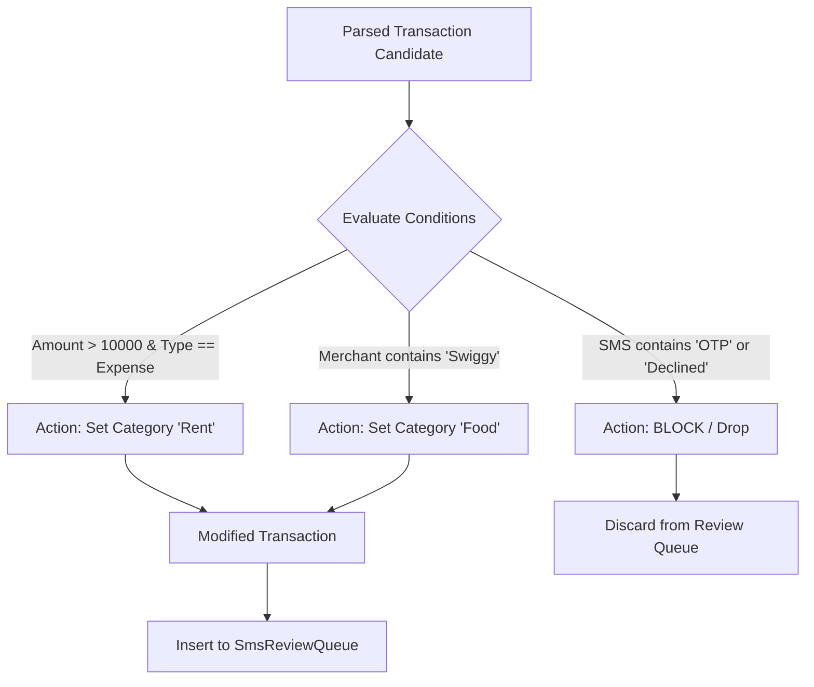
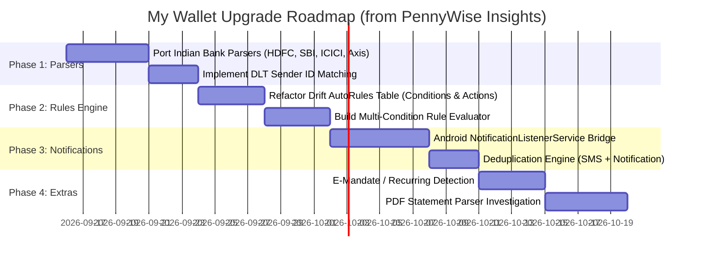

# PennyWise AI Tracker — Technical Analysis & Strategic Integration Report

**Target Audience:** Lead Agent / Technical Lead  
**Subject:** Feasibility and Value Analysis of [sarim2000/pennywiseai-tracker](https://github.com/sarim2000/pennywiseai-tracker) for the **My Wallet** Codebase  
**Date:** September 15, 2026  
**Status:** Complete Analysis & Proposed Roadmap  

---

## 1. Executive Summary

A comprehensive architectural and functional review was performed on **PennyWise AI Tracker** (`sarim2000/pennywiseai-tracker`), an open-source (AGPL v3) privacy-first expense tracker built with Kotlin Multiplatform (KMP), Jetpack Compose, Android Room, and Google AI Edge LiteRT-LM.

### Alignment with My Wallet
Our project, **My Wallet**, is a Flutter application utilizing **Riverpod** for state management, **Drift (SQLite)** for local persistence, and **Gemini API** for AI Copilot features. We already maintain a transaction review queue (`SmsReviewQueue`), basic SMS parsing (`RegexParser`), an automation rules feature (`AutoRules`), and recurring transaction tracking.

However, PennyWise solves several critical real-world friction points that our current implementation encounters. Most notably:
1. **54+ Production-Grade Indian Bank Parsers** with Indian DLT telecom sender handling.
2. **Android Status Bar Notification Listener** for modern UPI/fintech apps that bypass SMS.
3. **Multi-Condition Rules Engine** supporting amount comparisons, bank account targeting, and block/modify pipelines.
4. **On-Device Private AI Model Execution** using Google AI Edge LiteRT-LM.
5. **Hard Financial Integrity Guards** (strict multi-currency aggregation guarantees).

This document details the extracted insights, component comparisons, and an actionable phased integration roadmap.

---

## 2. Feature & Architectural Comparison Matrix

| Domain | Current `My Wallet` Implementation | `PennyWise AI Tracker` Implementation | Value / Potential Impact for My Wallet |
| :--- | :--- | :--- | :--- |
| **SMS Parsing** | Single generic regex parser in [`regex_parser.dart`](file:///d:/PERSONAL/CODING/PROJECTS/My%20Wallet/lib/core/parsing/regex_parser.dart) (~170 LOC) | Modular `parser-core` with dedicated parsers for 157 banks across 24 countries (54 Indian banks & fintechs) | **CRITICAL**: Eliminates misparsed amounts, missing merchants, and unhandled bank SMS formats. |
| **Push Notifications** | None (relies exclusively on user SMS) | Android `NotificationListenerService` capturing push notifications from banking & UPI apps | **HIGH**: Captures transactions from apps like GPay, CRED, and PhonePe when SMS is suppressed. |
| **Rules Engine** | Basic substring matching (`merchant_contains`, `sms_body_contains`) in [`rules_repository.dart`](file:///d:/PERSONAL/CODING/PROJECTS/My%20Wallet/lib/features/rules/data/rules_repository.dart) | Multi-condition engine (Amount `<`/`>`, Account composite, Time/Day, Category, Merchant) + Block/Transform actions | **HIGH**: Enables automated filtering, tagging, and suppression of non-expense transactions (e.g. transfers, OTPs). |
| **AI Assistant** | Cloud-based via Google Gemini API in [`copilot_service.dart`](file:///d:/PERSONAL/CODING/PROJECTS/My%20Wallet/lib/features/copilot/data/copilot_service.dart) | 100% on-device local LLM (Qwen 2.5 via Google AI Edge LiteRT-LM) | **MEDIUM/LONG-TERM**: Enables offline usage and zero-leak privacy for sensitive financial queries. |
| **Subscriptions** | Manual setup in [`features/recurring`](file:///d:/PERSONAL/CODING/PROJECTS/My%20Wallet/lib/features/recurring) | Automatic detection from bank e-mandate and SI debit SMS notifications | **MEDIUM**: Auto-discovers recurring subscriptions right from incoming bank messages. |
| **Statement Import** | Receipt OCR scanning via Google ML Kit | PDF bank statement parsing (`SharedPdfTextExtractor`) for statement imports | **MEDIUM**: Allows bulk backfilling of past transactions without historical SMS. |
| **Currency Handling** | Single default currency formatting | Strict currency-tagging per transaction; compile-time prevention of mixed-currency sums | **HIGH**: Prevents accidental summation of multi-currency transactions. |

---

## 3. Deep-Dive Component Breakdown

### 3.1. SMS & DLT Sender Parsing Engine (`parser-core`)

#### PennyWise Implementation
PennyWise isolates its parser into a pure Kotlin multiplatform module (`parser-core/`), free of Android runtime dependencies.
- **DLT Telecom Sender Matching**: Indian SMS regulation requires headers like `AD-HDFCBK`, `BZ-SBIINB`, `VK-ICICIB`. PennyWise maps sender header patterns to bank parsers using compiled regex rules:
  ```kotlin
  // Example pattern matching
  val DLT_PATTERNS = listOf(
      Regex("""^[A-Z]{2}-HDFCBK$"""),
      Regex("""^[A-Z]{2}-HDFC$""")
  )
  ```
- **Specialized Bank Parsers**: Inherit from `BaseIndianBankParser`, which supplies shared routines for Indian number systems (lakhs/crores comma formatting), UPI reference extraction (`UPI:1234567890`), and e-mandate notifications.
- **Edge-Case Normalization**:
  - HDFC refund/reversal padded strings: `"... By AMAZON        000 On 2026-08-21"`
  - ATM cash withdrawals: Extracts ATM location rather than labeling "ATM" as the vendor.
  - UPI VPA stripping: Strips handles like `@okhdfcbank`, `@paytm`, `@ybl` into clean merchant names.

#### Application to My Wallet
We can migrate `My Wallet` from a single monolithic regex into a **Chain of Responsibility** or **Strategy Pattern** in Dart:
```
Incoming SMS/Notification
       │
       ▼
BankDetector (matches DLT sender / bank header)
       │
   ┌───┴───────────────────────┐
   ▼                           ▼
Known Bank Parser        Fallback Generic Parser
(HDFC, SBI, ICICI, etc.) (Enhanced regex)
   │                           │
   └───────────┬───────────────┘
               ▼
        Rules Engine Filter
               ▼
        SmsReviewQueue (Drift DB)
```

---

### 3.2. Android Bank Notification Listener

#### Problem
Fintech apps (CRED, Google Pay, PhonePe, Navi, Slice, Jupiter) increasingly communicate transaction receipts solely via Android notifications, or users maintain separate devices/e-SIMs where SMS isn't the primary alert channel.

#### PennyWise Solution
PennyWise introduces [`BankNotificationListenerService`](https://github.com/sarim2000/pennywiseai-tracker/blob/main/app/src/main/java/com/pennywiseai/tracker/receiver/BankNotificationListenerService.kt):
- Extends Android's native `NotificationListenerService`.
- Filters active notifications by allowed package names (`com.google.android.apps.nbu.paisa.user`, `com.phonepe.app`, `net.one97.paytm`, `com.dreamplug.androidapp`, etc.).
- Extracts title, body, subtext, and timestamp, routing them through the standard `SmsTransactionProcessor`.
- Implements transaction deduplication (`TransactionDeduplication`) using a composite hash of `(Amount + AccountMask + TimestampWindow + Merchant)` to avoid duplicate entries when both SMS and notification arrive for the same purchase.

#### Application to My Wallet
We can implement an Android native bridge or use an existing Flutter background service package to pipe `StatusBarNotification` payloads into our existing `QueueRepository.addToQueue(...)`.

---

### 3.3. Advanced Smart Rules Engine

#### PennyWise Architecture
Located in `app/src/main/java/com/pennywiseai/tracker/domain/service/RuleEngine.kt`.
Rules are structured with distinct `Conditions` and `Actions`:



#### Condition Fields Supported:
- `AMOUNT`: `<`, `>`, `=`, range.
- `ACCOUNT`: Specific bank account / card last 4 digits (`BankName||Last4`).
- `TYPE`: Income / Expense / Transfer.
- `DAY_OF_WEEK` / `DAY_OF_MONTH`: Allows capturing recurring monthly bills (e.g. rent on the 1st).
- `TIME` / `HOUR`: Identifies late-night food orders, commutes, etc.
- `MERCHANT` / `SMS_TEXT` / `BANK_NAME`.

#### Actions Supported:
- `SET`: Overrides category, merchant name, or transaction type.
- `APPEND` / `PREPEND`: Appends tags or notes.
- `BLOCK`: Drops transaction completely before it clutters the review inbox.

---

### 3.4. On-Device Private AI Engine

#### PennyWise Implementation
- Uses **Google AI Edge LiteRT-LM** (`com.google.ai.edge.litertlm`) running a local quantized **Qwen 2.5** LLM.
- All chats, summarization queries ("How much did I spend on groceries?"), and parsing heuristics execute on the mobile device GPU/NPU.
- Zero network traffic, zero third-party telemetry, 100% GDPR/privacy compliance.

#### Comparison for My Wallet
- `My Wallet` currently uses the cloud Gemini API ([`copilot_service.dart`](file:///d:/PERSONAL/CODING/PROJECTS/My%20Wallet/lib/features/copilot/data/copilot_service.dart)), which offers superior reasoning, conversational nuance, and zero local storage overhead.
- **Recommendation**: Maintain Gemini as the primary Copilot engine, but consider an opt-in "Private Local Mode" (using Flutter on-device LLM solutions or LiteRT via FFI) for users who prefer not to store an API key.

---

### 3.5. Multi-Currency Financial Integrity Safeguards

PennyWise enforces strict architecture-level invariants for financial accuracy:
1. **Never sum amounts across currencies**: `Iterable.sumByCurrency(...)` groups by currency code into a `Map<Currency, Money>`. An exception is thrown if `+` is called on disparate currencies.
2. **Currency-Tagged Formatters**: All UI representations require an explicit currency code; default unformatted numbers are strictly forbidden.

In `My Wallet`, as we scale multi-currency and investment tracking, adopting this invariant will prevent multi-currency calculation corruption.

---

## 4. Proposed Implementation Roadmap for My Wallet



### Phase 1: Production-Grade Indian Bank Parsers (High ROI, Quick Win)
- **Goal**: Replace simple regexes in [`lib/core/parsing/regex_parser.dart`](file:///d:/PERSONAL/CODING/PROJECTS/My%20Wallet/lib/core/parsing/regex_parser.dart) with specialized bank parser modules based on PennyWise's `parser-core`.
- **Target Banks**: HDFC, State Bank of India (SBI), ICICI Bank, Axis Bank, Kotak Mahindra, CRED, and Google Pay / PhonePe UPI alerts.
- **Features to Port**:
  - DLT Sender ID prefix matching (`[A-Z]{2}-[A-Z]{6}`).
  - Precise balance extraction after debit/credit.
  - Merchant name cleanup and VPA stripping.

### Phase 2: Enhanced Smart Rules Engine
- **Goal**: Upgrade [`RulesRepository`](file:///d:/PERSONAL/CODING/PROJECTS/My%20Wallet/lib/features/rules/data/rules_repository.dart) and Drift schema.
- **Changes**:
  - Support `amount` thresholds (`> 5000`), `accountId`, `timeOfDay`, and `type`.
  - Add `BLOCK` action to automatically suppress non-actionable messages (promotions, OTPs, failed attempts) from ever entering the `SmsReviewQueue`.

### Phase 3: Android Bank Notification Ingestion
- **Goal**: Ingest push notifications from UPI apps and bank mobile apps.
- **Changes**:
  - Create a lightweight Android platform plugin (`NotificationListenerService`).
  - Send incoming notifications to Dart via EventChannel.
  - Apply the deduplication hash so an SMS and a Push Notification for the same payment don't create two queue items.

### Phase 4: E-Mandate & Subscription Auto-Discovery
- **Goal**: Automatically prompt the user when a subscription mandate SMS arrives.
- **Changes**:
  - Add `MandateInfo` extraction to bank parsers.
  - Suggest adding to [`features/recurring`](file:///d:/PERSONAL/CODING/PROJECTS/My%20Wallet/lib/features/recurring) upon approving from `inbox`.

---

## 5. Summary & Recommendation for Lead Agent

The `pennywiseai-tracker` repository is an exceptional reference for real-world transaction parsing, bank notification capture, and automation rules in the Indian and global fintech landscape. 

By strategically adapting its **bank regex patterns**, **notification listener architecture**, and **smart rules engine**, we can significantly elevate `My Wallet`'s automated transaction tracking while keeping our modern Flutter, Riverpod, and Drift architecture clean and extensible.
